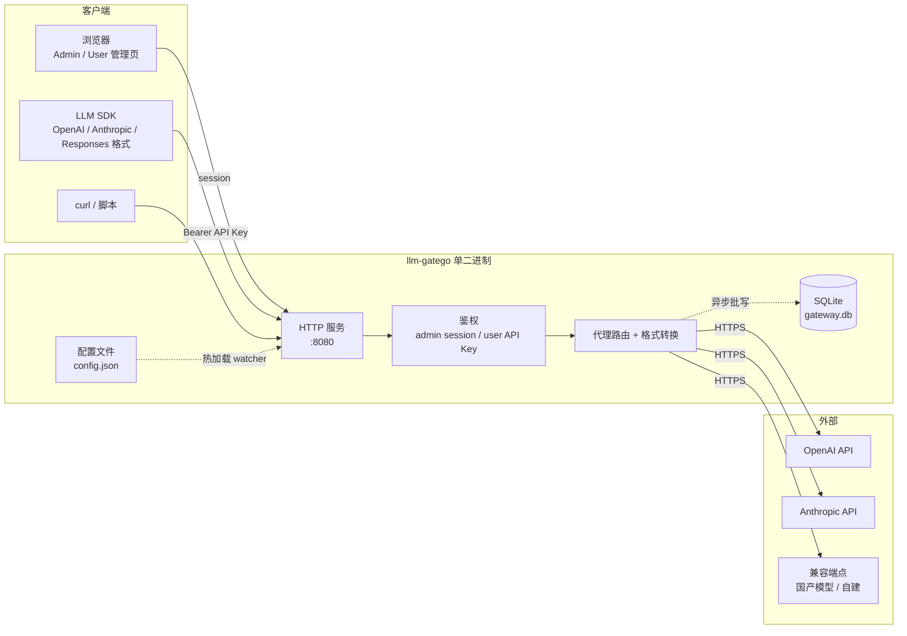
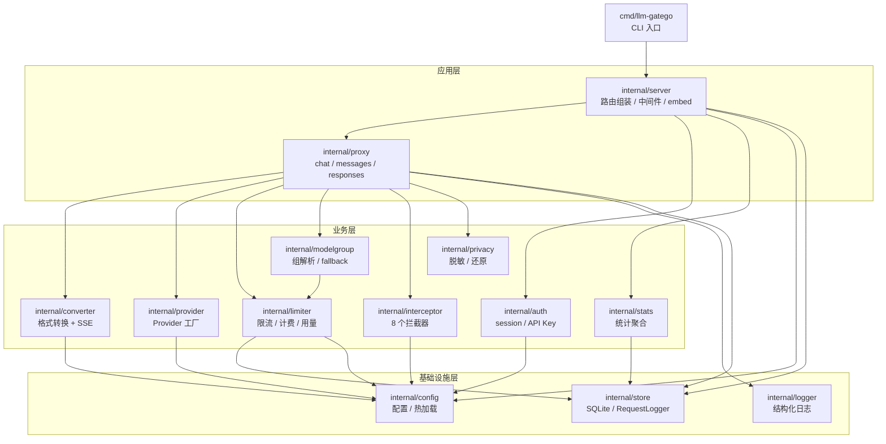
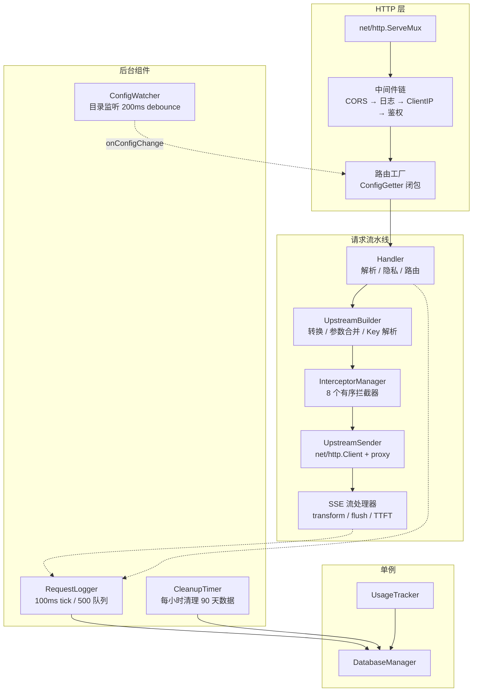
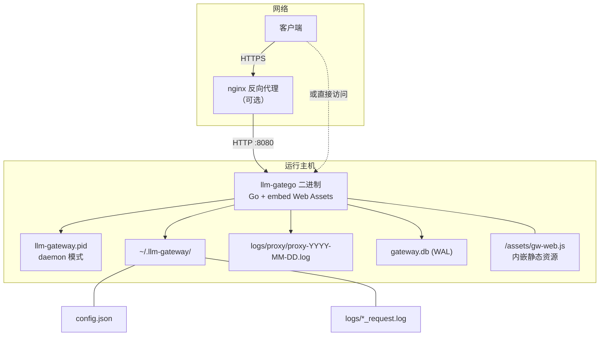

# llm-gatego 架构总览

## 1. 系统上下文

```mermaid
flowchart LR
    subgraph Clients["客户端"]
        Browser["浏览器<br/>Admin / User 管理页"]
        SDK["LLM SDK<br/>OpenAI / Anthropic / Responses 格式"]
        CLI["curl / 脚本"]
    end

    subgraph System["llm-gatego 单二进制"]
        GW["HTTP 服务<br/>:8080"]
        Auth["鉴权<br/>admin session / user API Key"]
        Proxy["代理路由 + 格式转换"]
        Store[("SQLite<br/>gateway.db")]
        Config["配置文件<br/>config.json"]
    end

    subgraph External["外部"]
        OpenAI["OpenAI API"]
        Anthropic["Anthropic API"]
        Custom["兼容端点<br/>国产模型 / 自建"]
    end

    Browser -->|"session"| GW
    SDK -->|"Bearer API Key"| GW
    CLI --> GW

    GW --> Auth
    Auth --> Proxy
    Proxy -->|"HTTPS"| OpenAI
    Proxy -->|"HTTPS"| Anthropic
    Proxy -->|"HTTPS"| Custom
    Proxy -.->|"异步批写"| Store
    Config -.->|"热加载 watcher"| GW
```

## 2. 顶层组件图（包依赖，无环）

```mermaid
flowchart TD
    CMD["cmd/llm-gatego<br/>CLI 入口"]

    subgraph App["应用层"]
        Server["internal/server<br/>路由组装 / 中间件 / embed"]
        Proxy["internal/proxy<br/>chat / messages / responses"]
    end

    subgraph Domain["业务层"]
        Converter["internal/converter<br/>格式转换 + SSE"]
        Provider["internal/provider<br/>Provider 工厂"]
        Limiter["internal/limiter<br/>限流 / 计费 / 用量"]
        ModelGroup["internal/modelgroup<br/>组解析 / fallback"]
        Interceptor["internal/interceptor<br/>8 个拦截器"]
        Privacy["internal/privacy<br/>脱敏 / 还原"]
        Auth["internal/auth<br/>session / API Key"]
        Stats["internal/stats<br/>统计聚合"]
    end

    subgraph Infra["基础设施层"]
        Config["internal/config<br/>配置 / 热加载"]
        Store["internal/store<br/>SQLite / RequestLogger"]
        Logger["internal/logger<br/>结构化日志"]
    end

    CMD --> Server
    Server --> Proxy
    Server --> Auth
    Server --> Stats
    Server --> Config
    Server --> Store

    Proxy --> Converter
    Proxy --> Provider
    Proxy --> Limiter
    Proxy --> ModelGroup
    Proxy --> Interceptor
    Proxy --> Privacy
    Proxy --> Logger
    Proxy --> Store

    Limiter --> Store
    Limiter --> Config
    ModelGroup --> Limiter
    Interceptor --> Config
    Stats --> Store
    Auth --> Config
    Converter --> Config
    Provider --> Config
```

## 3. 运行时组件图

```mermaid
flowchart TB
    subgraph HTTPLayer["HTTP 层"]
        Mux["net/http.ServeMux"]
        MW["中间件链<br/>CORS → 日志 → ClientIP → 鉴权"]
        Routes["路由工厂<br/>ConfigGetter 闭包"]
    end

    subgraph Pipeline["请求流水线"]
        Handler["Handler<br/>解析 / 隐私 / 路由"]
        Build["UpstreamBuilder<br/>转换 / 参数合并 / Key 解析"]
        Chain["InterceptorManager<br/>8 个有序拦截器"]
        Sender["UpstreamSender<br/>net/http.Client + proxy"]
        Stream["SSE 流处理器<br/>transform / flush / TTFT"]
    end

    subgraph Background["后台组件"]
        Watcher["ConfigWatcher<br/>目录监听 200ms debounce"]
        ReqLogger["RequestLogger<br/>100ms tick / 500 队列"]
        Cleanup["CleanupTimer<br/>每小时清理 90 天数据"]
    end

    subgraph Singletons["单例"]
        UM["UsageTracker"]
        DM["DatabaseManager"]
    end

    Mux --> MW --> Routes --> Handler
    Handler --> Build --> Chain --> Sender
    Sender --> Stream
    Stream -.-> ReqLogger
    Handler -.-> ReqLogger
    Watcher -.->|"onConfigChange"| Routes
    ReqLogger --> DM
    Cleanup --> DM
    UM --> DM
```

## 4. 部署图

```mermaid
flowchart TB
    subgraph Host["运行主机"]
        Binary["llm-gatego 二进制<br/>Go + embed Web Assets"]
        PID["llm-gateway.pid<br/>daemon 模式"]
        CFG["~/.llm-gateway/"]
        logs["logs/proxy/proxy-YYYY-MM-DD.log"]
        DB["gateway.db (WAL)"]
        Web["/assets/gw-web.js<br/>内嵌静态资源"]
    end

    subgraph Network["网络"]
        Nginx["nginx 反向代理<br/>（可选）"]
        Client["客户端"]
    end

    Client -->|"HTTPS"| Nginx
    Nginx -->|"HTTP :8080"| Binary
    Client -.->|"或直接访问"| Binary

    Binary --> PID
    Binary --> CFG
    Binary --> logs
    Binary --> DB
    Binary --- Web

    CFG --- config["config.json"]
    CFG --- detail["logs/*_request.log"]
```
