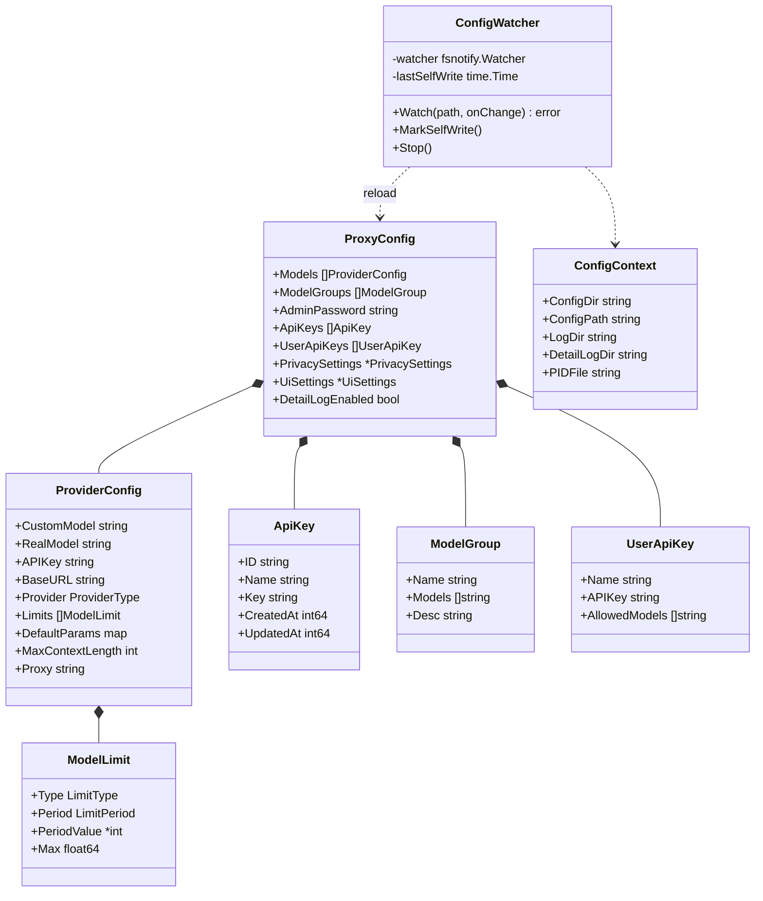
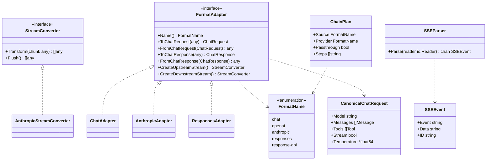
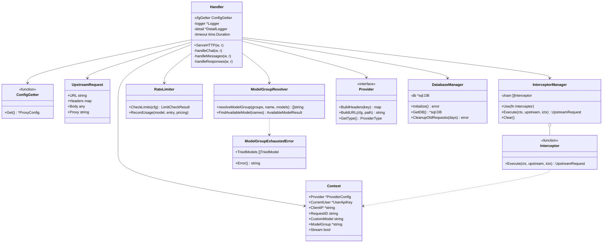
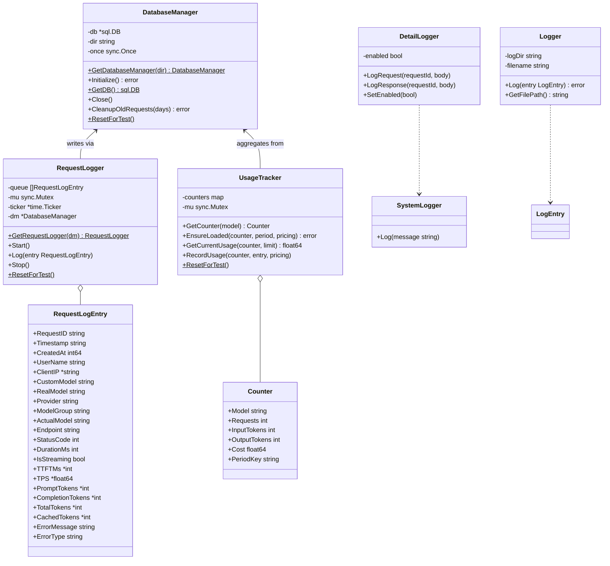

# llm-gatego UML 类图

## 1. 配置域

```mermaid
classDiagram
    class ProxyConfig {
        +Models []ProviderConfig
        +ModelGroups []ModelGroup
        +AdminPassword string
        +ApiKeys []ApiKey
        +UserApiKeys []UserApiKey
        +PrivacySettings *PrivacySettings
        +UiSettings *UiSettings
        +DetailLogEnabled bool
    }
    class ProviderConfig {
        +CustomModel string
        +RealModel string
        +APIKey string
        +BaseURL string
        +Provider ProviderType
        +Limits []ModelLimit
        +DefaultParams map
        +MaxContextLength int
        +Proxy string
    }
    class ModelLimit {
        +Type LimitType
        +Period LimitPeriod
        +PeriodValue *int
        +Max float64
    }
    class ApiKey {
        +ID string
        +Name string
        +Key string
        +CreatedAt int64
        +UpdatedAt int64
    }
    class ModelGroup {
        +Name string
        +Models []string
        +Desc string
    }
    class UserApiKey {
        +Name string
        +APIKey string
        +AllowedModels []string
    }
    class ConfigContext {
        +ConfigDir string
        +ConfigPath string
        +LogDir string
        +DetailLogDir string
        +PIDFile string
    }
    class ConfigWatcher {
        -watcher fsnotify.Watcher
        -lastSelfWrite time.Time
        +Watch(path, onChange) error
        +MarkSelfWrite()
        +Stop()
    }

    ProxyConfig *-- ProviderConfig
    ProviderConfig *-- ModelLimit
    ProxyConfig *-- ApiKey
    ProxyConfig *-- ModelGroup
    ProxyConfig *-- UserApiKey
    ConfigWatcher ..> ProxyConfig : reload
    ConfigWatcher ..> ConfigContext
```

## 2. 转换域

```mermaid
classDiagram
    class FormatName {
        <<enumeration>>
        chat
        openai
        anthropic
        responses
        response-api
    }
    class StreamConverter {
        <<interface>>
        +Transform(chunk any) []any
        +Flush() []any
    }
    class FormatAdapter {
        <<interface>>
        +Name() FormatName
        +ToChatRequest(any) ChatRequest
        +FromChatRequest(ChatRequest) any
        +ToChatResponse(any) ChatResponse
        +FromChatResponse(ChatResponse) any
        +CreateUpstreamStream() StreamConverter
        +CreateDownstreamStream() StreamConverter
    }
    class ChatAdapter
    class AnthropicAdapter
    class ResponsesAdapter
    class ChainPlan {
        +Source FormatName
        +Provider FormatName
        +Passthrough bool
        +Steps []string
    }
    class CanonicalChatRequest {
        +Model string
        +Messages []Message
        +Tools []Tool
        +Stream bool
        +Temperature *float64
    }
    class SSEParser {
        +Parse(reader io.Reader) chan SSEEvent
    }
    class SSEEvent {
        +Event string
        +Data string
        +ID string
    }

    FormatAdapter <|.. ChatAdapter
    FormatAdapter <|.. AnthropicAdapter
    FormatAdapter <|.. ResponsesAdapter
    FormatAdapter ..> FormatName
    FormatAdapter ..> CanonicalChatRequest
    ChainPlan ..> FormatName
    StreamConverter <|.. AnthropicStreamConverter
    SSEParser ..> SSEEvent
```

## 3. 运行域

```mermaid
classDiagram
    class Handler {
        -cfgGetter ConfigGetter
        -logger *Logger
        -detail *DetailLogger
        -timeout time.Duration
        +ServeHTTP(w, r)
        -handleChat(w, r)
        -handleMessages(w, r)
        -handleResponses(w, r)
    }
    class ConfigGetter {
        <<function>>
        +Get() *ProxyConfig
    }
    class UpstreamRequest {
        +URL string
        +Headers map
        +Body any
        +Proxy string
    }
    class InterceptorManager {
        -chain []Interceptor
        +Use(fn Interceptor)
        +Execute(ctx, upstream, ictx) UpstreamRequest
        +Clear()
    }
    class Interceptor {
        <<function>>
        +Execute(ctx, upstream, ictx) UpstreamRequest
    }
    class Context {
        +Provider *ProviderConfig
        +CurrentUser *UserApiKey
        +ClientIP *string
        +RequestID string
        +CustomModel string
        +ModelGroup *string
        +Stream bool
    }
    class RateLimiter {
        +CheckLimits(cfg) LimitCheckResult
        +RecordUsage(model, entry, pricing)
    }
    class ModelGroupResolver {
        +resolveModelGroup(groups, name, models) []string
        +FindAvailableModel(names) AvailableModelResult
    }
    class ModelGroupExhaustedError {
        +TriedModels []TriedModel
        +Error() string
    }
    class Provider {
        <<interface>>
        +BuildHeaders(key) map
        +BuildURL(cfg, path) string
        +GetType() ProviderType
    }
    class DatabaseManager {
        -db *sql.DB
        +Initialize() error
        +GetDB() *sql.DB
        +CleanupOldRequests(days) error
    }

    Handler --> ConfigGetter
    Handler --> UpstreamRequest
    Handler --> InterceptorManager
    Handler --> RateLimiter
    Handler --> ModelGroupResolver
    Handler --> Provider
    Handler --> DatabaseManager
    Handler --> Context
    InterceptorManager o-- Interceptor
    Interceptor ..> Context
    ModelGroupResolver ..> ModelGroupExhaustedError
```

## 4. 持久化域

```mermaid
classDiagram
    class DatabaseManager {
        -db *sql.DB
        -dir string
        -once sync.Once
        +GetDatabaseManager(dir)$ DatabaseManager
        +Initialize() error
        +GetDB()$ sql.DB
        +Close()
        +CleanupOldRequests(days) error
        +ResetForTest()$
    }
    class RequestLogger {
        -queue []RequestLogEntry
        -mu sync.Mutex
        -ticker *time.Ticker
        -dm *DatabaseManager
        +GetRequestLogger(dm)$ RequestLogger
        +Start()
        +Log(entry RequestLogEntry)
        +Stop()
        +ResetForTest()$
    }
    class RequestLogEntry {
        +RequestID string
        +Timestamp string
        +CreatedAt int64
        +UserName string
        +ClientIP *string
        +CustomModel string
        +RealModel string
        +Provider string
        +ModelGroup string
        +ActualModel string
        +Endpoint string
        +StatusCode int
        +DurationMs int
        +IsStreaming bool
        +TTFTMs *int
        +TPS *float64
        +PromptTokens *int
        +CompletionTokens *int
        +TotalTokens *int
        +CachedTokens *int
        +ErrorMessage string
        +ErrorType string
    }
    class UsageTracker {
        -counters map
        -mu sync.Mutex
        +GetCounter(model) Counter
        +EnsureLoaded(counter, period, pricing) error
        +GetCurrentUsage(counter, limit) float64
        +RecordUsage(counter, entry, pricing)
        +ResetForTest()$
    }
    class Counter {
        +Model string
        +Requests int
        +InputTokens int
        +OutputTokens int
        +Cost float64
        +PeriodKey string
    }
    class Logger {
        -logDir string
        -filename string
        +Log(entry LogEntry) error
        +GetFilePath() string
    }
    class DetailLogger {
        -enabled bool
        +LogRequest(requestId, body)
        +LogResponse(requestId, body)
        +SetEnabled(bool)
    }
    class SystemLogger {
        +Log(message string)
    }

    DatabaseManager <-- RequestLogger : writes via
    RequestLogger o-- RequestLogEntry
    DatabaseManager <-- UsageTracker : aggregates from
    UsageTracker o-- Counter
    Logger ..> LogEntry
    DetailLogger ..> SystemLogger
```
