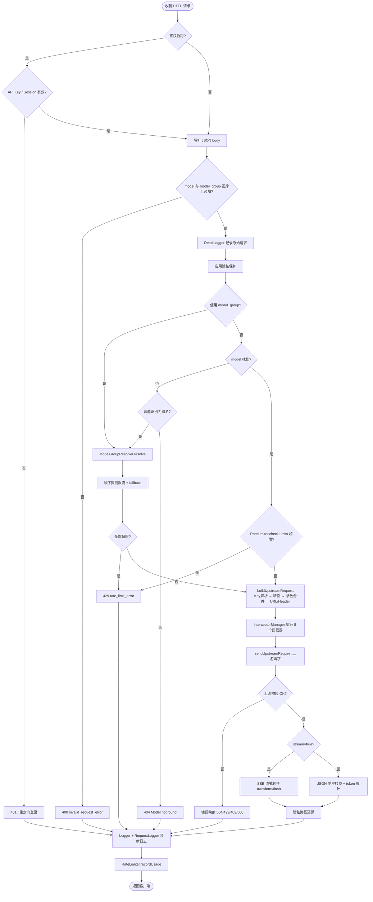
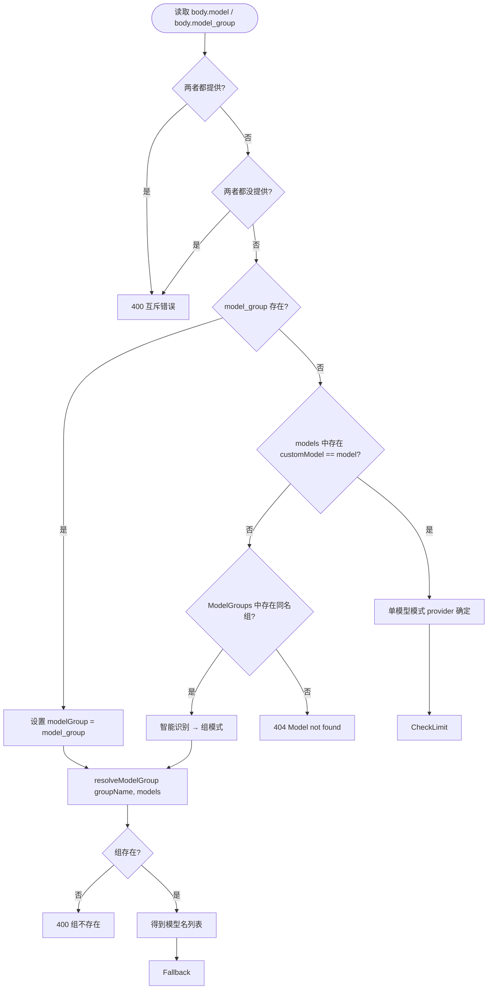
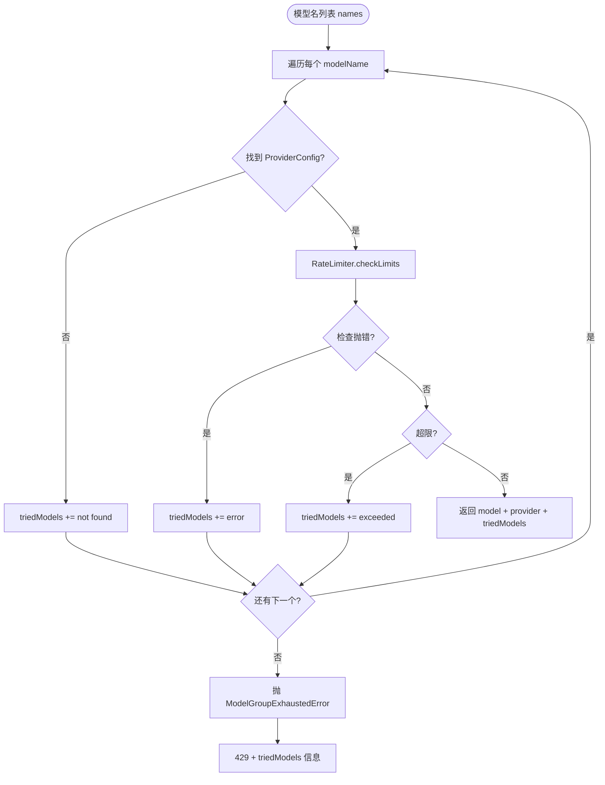
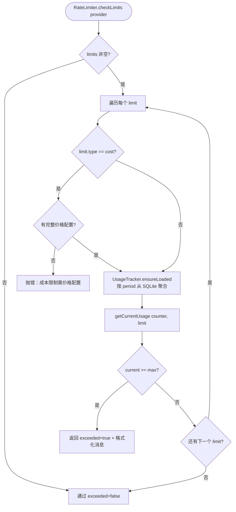
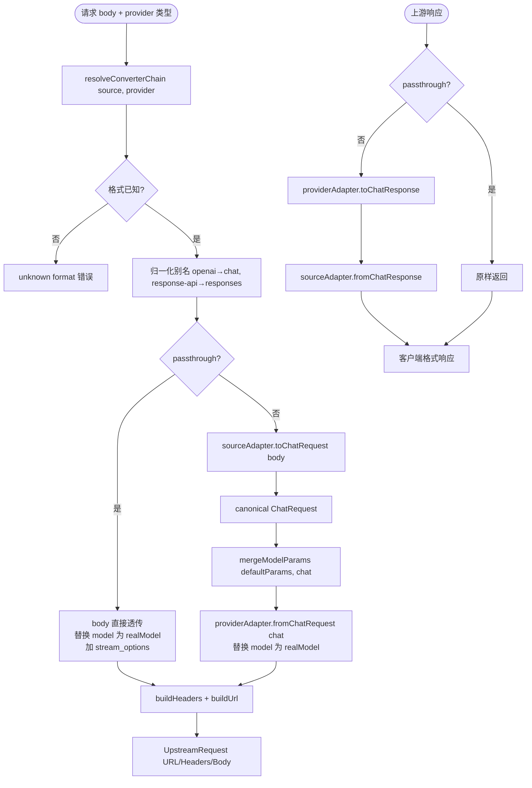
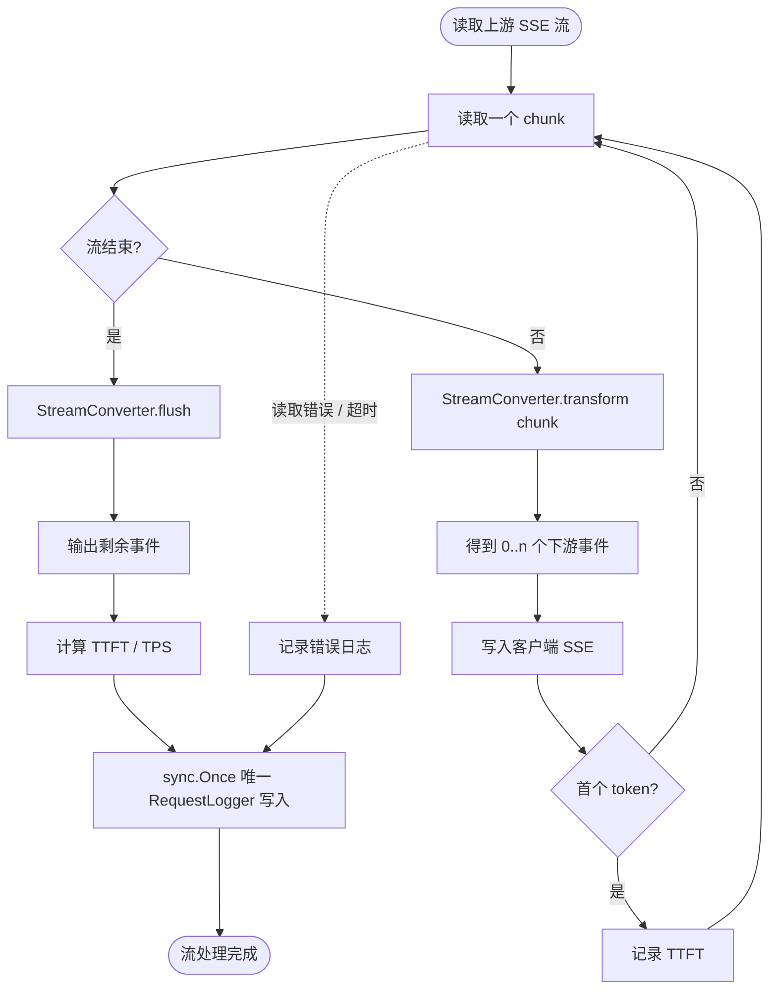
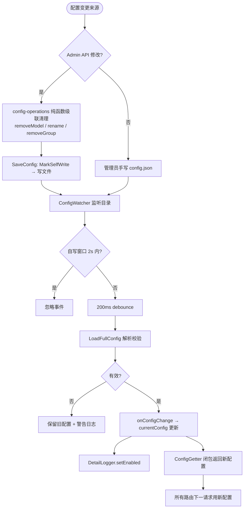
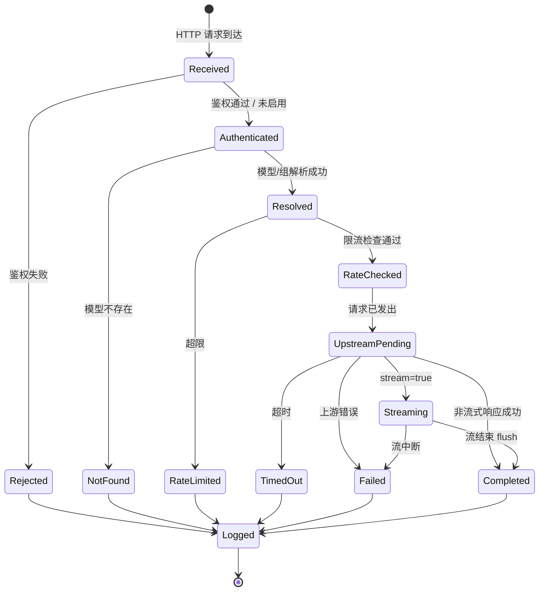
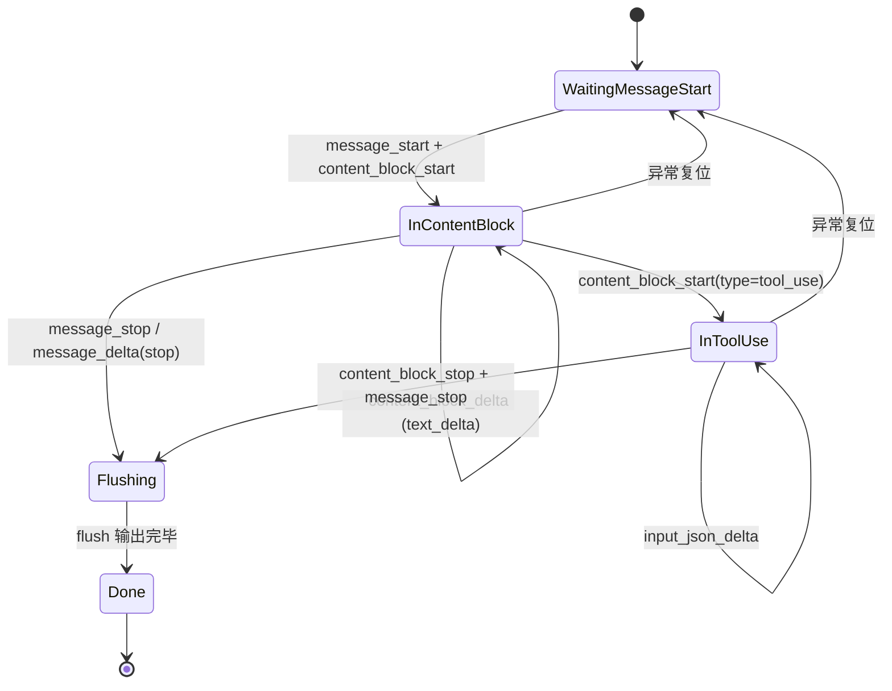

# llm-gatego 流程图与状态机

## 1. 请求生命周期全流程

```mermaid
flowchart TD
    Start([收到 HTTP 请求]) --> Auth{鉴权启用?}
    Auth -->|"是"| CheckKey{API Key / Session 有效?}
    CheckKey -->|"否"| E401[401 / 重定向登录]
    Auth -->|"否"| Parse
    CheckKey -->|"是"| Parse

    Parse[解析 JSON body] --> Validate{model 与 model_group 互斥且必填?}
    Validate -->|"否"| E400[400 invalid_request_error]
    Validate -->|"是"| Detail[DetailLogger 记录原始请求]
    Detail --> Privacy[应用隐私保护]

    Privacy --> Group{使用 model_group?}
    Group -->|"是"| Resolve[ModelGroupResolver.resolve]
    Resolve --> Fallback[顺序探测限流 + fallback]
    Fallback --> Exhausted{全部超限?}
    Exhausted -->|"是"| E429[429 rate_limit_error]
    Exhausted -->|"否"| Build

    Group -->|"否"| Find{model 找到?}
    Find -->|"否"| Smart{智能识别为组名?}
    Smart -->|"是"| Resolve
    Smart -->|"否"| E404[404 Model not found]
    Find -->|"是"| LimitCheck{RateLimiter.checkLimits 超限?}
    LimitCheck -->|"是"| E429
    LimitCheck -->|"否"| Build

    Build[buildUpstreamRequest<br/>Key解析 → 转换 → 参数合并 → URL/Header] --> Interceptors[InterceptorManager 执行 8 个拦截器]
    Interceptors --> Send[sendUpstreamRequest 上游请求]
    Send --> RespCheck{上游响应 OK?}
    RespCheck -->|"否"| ErrMap[错误映射 504/429/403/500]
    RespCheck -->|"是"| Stream{stream=true?}

    Stream -->|"是"| SSE[SSE 流式转换 transform/flush]
    Stream -->|"否"| JSON[JSON 响应转换 + token 统计]

    SSE --> Restore[隐私路径还原]
    JSON --> Restore
    Restore --> Log[Logger + RequestLogger 异步日志]
    Log --> Record[RateLimiter.recordUsage]
    Record --> Done([返回客户端])

    E400 --> Log
    E401 --> Log
    E404 --> Log
    E429 --> Log
    ErrMap --> Log
```

## 2. 模型 / 模型组判定流程

```mermaid
flowchart TD
    Start([读取 body.model / body.model_group]) --> Both{两者都提供?}
    Both -->|"是"| Err[400 互斥错误]
    Both -->|"否"| Neither{两者都没提供?}
    Neither -->|"是"| Err
    Neither -->|"否"| Which{model_group 存在?}

    Which -->|"是"| GroupPath[设置 modelGroup = model_group]
    GroupPath --> ResolveGroup[resolveModelGroup groupName, models]
    ResolveGroup --> GroupFound{组存在?}
    GroupFound -->|"否"| GroupErr[400 组不存在]
    GroupFound -->|"是"| Names[得到模型名列表]

    Which -->|"否"| Direct{models 中存在 customModel == model?}
    Direct -->|"是"| Single[单模型模式 provider 确定]
    Direct -->|"否"| TryGroup{ModelGroups 中存在同名组?}
    TryGroup -->|"是"| Smart[智能识别 → 组模式]
    TryGroup -->|"否"| NotFound[404 Model not found]

    Smart --> ResolveGroup
    Names --> Fallback
    Single --> CheckLimit
```

## 3. 模型组 Fallback 流程

```mermaid
flowchart TD
    Start([模型名列表 names]) --> Loop[遍历每个 modelName]
    Loop --> Find{找到 ProviderConfig?}
    Find -->|"否"| Tried1[triedModels += not found]
    Find -->|"是"| CheckRate[RateLimiter.checkLimits]
    CheckRate --> Err{检查抛错?}
    Err -->|"是"| Tried2[triedModels += error]
    Err -->|"否"| Exceeded{超限?}
    Exceeded -->|"是"| Tried3[triedModels += exceeded]
    Exceeded -->|"否"| Success[返回 model + provider + triedModels]

    Tried1 --> More{还有下一个?}
    Tried2 --> More
    Tried3 --> More
    More -->|"是"| Loop
    More -->|"否"| Exhausted[抛 ModelGroupExhaustedError]
    Exhausted --> R429[429 + triedModels 信息]
```

## 4. 限流判定流程

```mermaid
flowchart TD
    Start([RateLimiter.checkLimits provider]) --> HasLimits{limits 非空?}
    HasLimits -->|"否"| Pass[通过 exceeded=false]
    HasLimits -->|"是"| Loop[遍历每个 limit]

    Loop --> TypeCheck{limit.type == cost?}
    TypeCheck -->|"是"| Pricing{有完整价格配置?}
    Pricing -->|"否"| ThrowCost[抛错：成本限制需价格配置]
    Pricing -->|"是"| Load
    TypeCheck -->|"否"| Load

    Load[UsageTracker.ensureLoaded<br/>按 period 从 SQLite 聚合] --> Current[getCurrentUsage counter, limit]
    Current --> Exceeded{current >= max?}
    Exceeded -->|"是"| Fail[返回 exceeded=true + 格式化消息]
    Exceeded -->|"否"| More{还有下一个 limit?}
    More -->|"是"| Loop
    More -->|"否"| Pass
```

## 5. 格式转换流程

```mermaid
flowchart TD
    Start([请求 body + provider 类型]) --> Resolve[resolveConverterChain source, provider]
    Resolve --> Known{格式已知?}
    Known -->|"否"| Err[unknown format 错误]
    Known -->|"是"| Norm[归一化别名 openai→chat, response-api→responses]
    Norm --> Pass{passthrough?}

    Pass -->|"是"| Direct[body 直接透传<br/>替换 model 为 realModel<br/>加 stream_options]

    Pass -->|"否"| Source[sourceAdapter.toChatRequest body]
    Source --> Canonical["canonical ChatRequest"]
    Canonical --> Merge[mergeModelParams defaultParams, chat]
    Merge --> Target[providerAdapter.fromChatRequest chat<br/>替换 model 为 realModel]

    Direct --> Headers[buildHeaders + buildUrl]
    Target --> Headers
    Headers --> Out[UpstreamRequest URL/Headers/Body]

    RespStart([上游响应]) --> RespPass{passthrough?}
    RespPass -->|"是"| RespDirect[原样返回]
    RespPass -->|"否"| ToChat[providerAdapter.toChatResponse]
    ToChat --> FromChat[sourceAdapter.fromChatResponse]
    FromChat --> RespOut[客户端格式响应]
    RespDirect --> RespOut
```

## 6. SSE 流式处理流程

```mermaid
flowchart TD
    Start([读取上游 SSE 流]) --> Chunk[读取一个 chunk]
    Chunk --> EOF{流结束?}
    EOF -->|"是"| Flush[StreamConverter.flush]
    Flush --> EmitFlush[输出剩余事件]
    EmitFlush --> Metrics[计算 TTFT / TPS]
    EOF -->|"否"| Transform[StreamConverter.transform chunk]
    Transform --> Events[得到 0..n 个下游事件]
    Events --> Emit[写入客户端 SSE]
    Emit --> FirstToken{首个 token?}
    FirstToken -->|"是"| TTFT[记录 TTFT]
    FirstToken -->|"否"| Chunk
    TTFT --> Chunk
    Metrics --> Once[sync.Once 唯一 RequestLogger 写入]
    Once --> Done([流处理完成])

    Chunk -.->|"读取错误 / 超时"| ErrLog[记录错误日志]
    ErrLog --> Once
```

## 7. 配置管理流程

```mermaid
flowchart TD
    Start([配置变更来源]) --> API{Admin API 修改?}
    API -->|"是"| Ops[config-operations 纯函数级联清理<br/>removeModel / rename / removeGroup]
    Ops --> Save[SaveConfig: MarkSelfWrite → 写文件]
    API -->|"否"| Manual[管理员手写 config.json]

    Save --> Watcher[ConfigWatcher 监听目录]
    Manual --> Watcher
    Watcher --> SelfWrite{自写窗口 2s 内?}
    SelfWrite -->|"是"| Ignore[忽略事件]
    SelfWrite -->|"否"| Debounce[200ms debounce]
    Debounce --> Reload[LoadFullConfig 解析校验]
    Reload --> Valid{有效?}
    Valid -->|"否"| KeepOld[保留旧配置 + 警告日志]
    Valid -->|"是"| Update[onConfigChange → currentConfig 更新]
    Update --> DetailToggle[DetailLogger.setEnabled]
    Update --> Getter[ConfigGetter 闭包返回新配置]
    Getter --> Routes[所有路由下一请求用新配置]
```

## 8. 请求生命周期状态机

```mermaid
stateDiagram-v2
    [*] --> Received: HTTP 请求到达
    Received --> Authenticated: 鉴权通过 / 未启用
    Received --> Rejected: 鉴权失败
    Authenticated --> Resolved: 模型/组解析成功
    Authenticated --> NotFound: 模型不存在
    Resolved --> RateChecked: 限流检查通过
    Resolved --> RateLimited: 超限
    RateChecked --> UpstreamPending: 请求已发出
    UpstreamPending --> Streaming: stream=true
    UpstreamPending --> Completed: 非流式响应成功
    Streaming --> Completed: 流结束 flush
    UpstreamPending --> TimedOut: 超时
    UpstreamPending --> Failed: 上游错误
    Streaming --> Failed: 流中断
    Rejected --> Logged
    NotFound --> Logged
    RateLimited --> Logged
    TimedOut --> Logged
    Failed --> Logged
    Completed --> Logged
    Logged --> [*]
```

## 9. 流式转换器状态机

```mermaid
stateDiagram-v2
    [*] --> WaitingMessageStart
    WaitingMessageStart --> InContentBlock: message_start + content_block_start
    InContentBlock --> InContentBlock: content_block_delta (text_delta)
    InContentBlock --> InToolUse: content_block_start(type=tool_use)
    InToolUse --> InToolUse: input_json_delta
    InContentBlock --> Flushing: message_stop / message_delta(stop)
    InToolUse --> Flushing: content_block_stop + message_stop
    Flushing --> Done: flush 输出完毕
    Done --> [*]
    InContentBlock --> WaitingMessageStart: 异常复位
    InToolUse --> WaitingMessageStart: 异常复位
```
