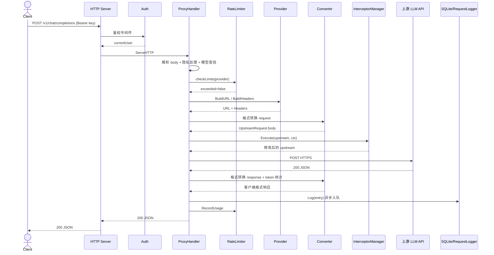
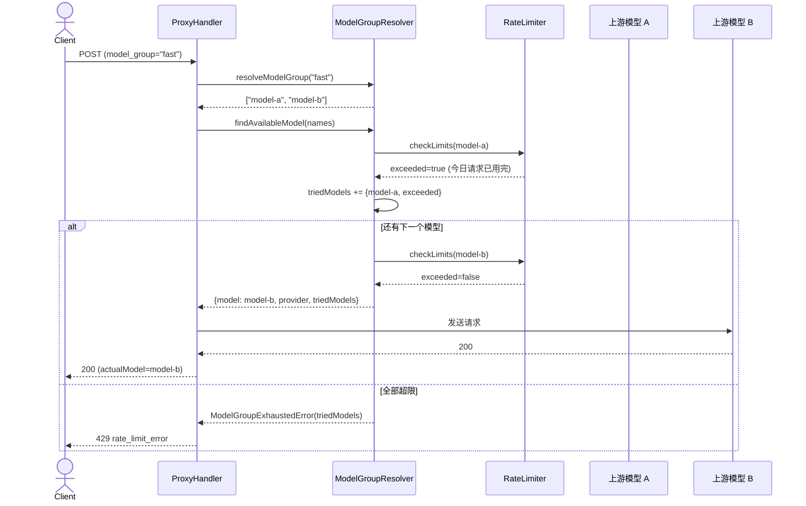
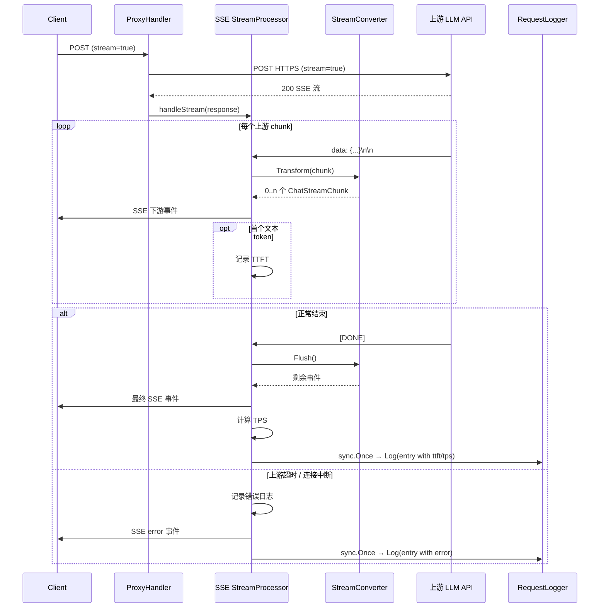
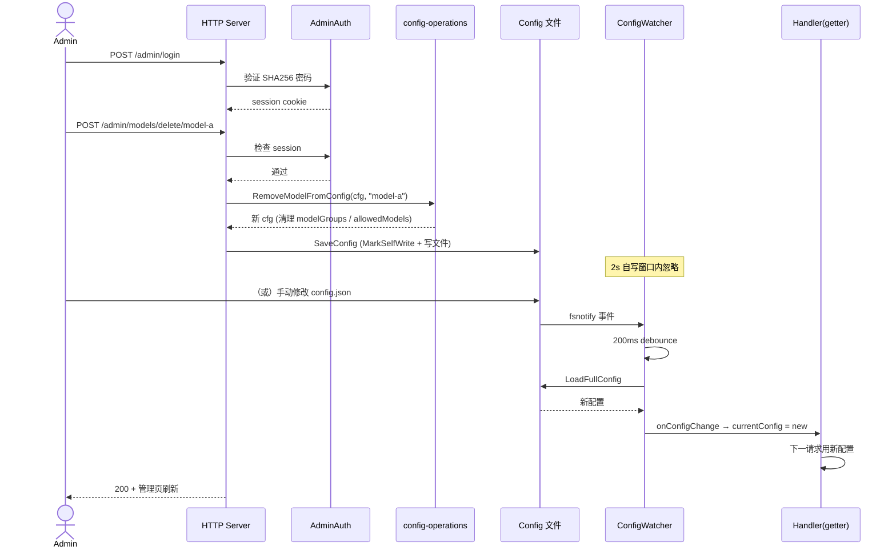
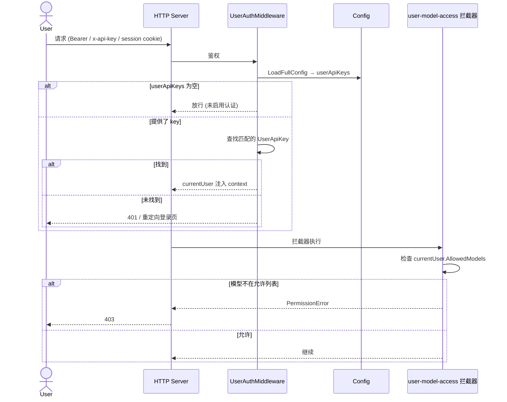
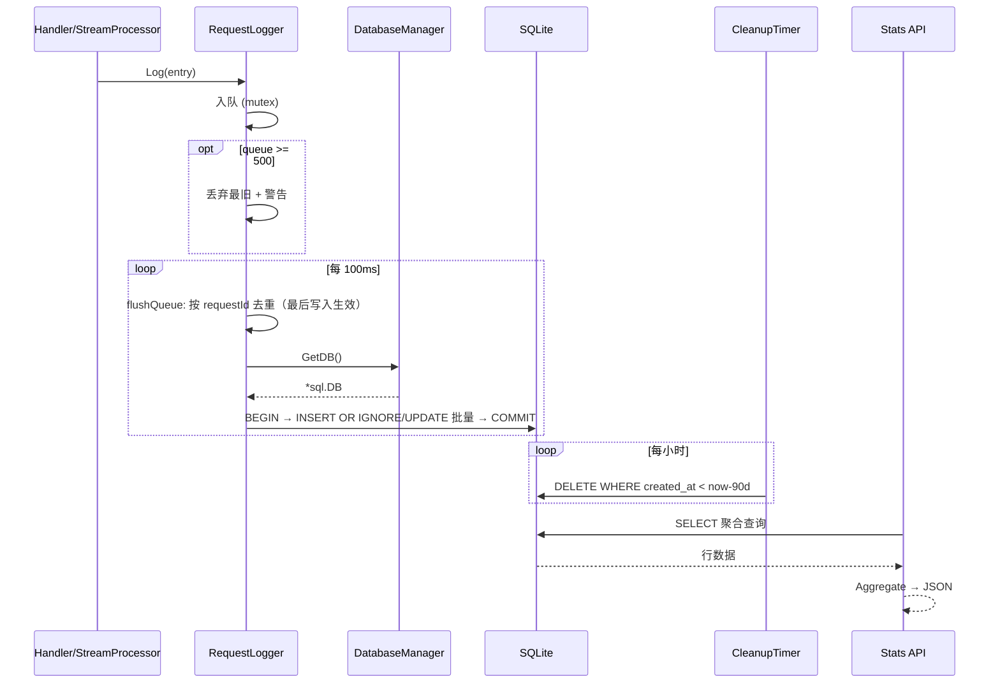

# llm-gatego 典型时序图

## 1. 单模型非流式请求

```mermaid
sequenceDiagram
    actor Client
    participant S as HTTP Server
    participant A as Auth
    participant H as ProxyHandler
    participant L as RateLimiter
    participant P as Provider
    participant C as Converter
    participant I as InterceptorManager
    participant U as 上游 LLM API
    participant DB as SQLite/RequestLogger

    Client->>S: POST /v1/chat/completions (Bearer key)
    S->>A: 鉴权中间件
    A-->>S: currentUser
    S->>H: ServeHTTP
    H->>H: 解析 body + 隐私处理 + 模型查找
    H->>L: checkLimits(provider)
    L-->>H: exceeded=false
    H->>P: BuildURL / BuildHeaders
    P-->>H: URL + Headers
    H->>C: 格式转换 request
    C-->>H: UpstreamRequest.body
    H->>I: Execute(upstream, ctx)
    I-->>H: 修改后的 upstream
    H->>U: POST HTTPS
    U-->>H: 200 JSON
    H->>C: 格式转换 response + token 统计
    C-->>H: 客户端格式响应
    H->>DB: Log(entry) 异步入队
    H->>L: RecordUsage
    H-->>S: 200 JSON
    S-->>Client: 200 JSON
```

## 2. 模型组 Fallback

```mermaid
sequenceDiagram
    actor Client
    participant H as ProxyHandler
    participant R as ModelGroupResolver
    participant L as RateLimiter
    participant U1 as 上游模型 A
    participant U2 as 上游模型 B

    Client->>H: POST (model_group="fast")
    H->>R: resolveModelGroup("fast")
    R-->>H: ["model-a", "model-b"]
    H->>R: findAvailableModel(names)
    R->>L: checkLimits(model-a)
    L-->>R: exceeded=true (今日请求已用完)
    R->>R: triedModels += {model-a, exceeded}
    alt 还有下一个模型
        R->>L: checkLimits(model-b)
        L-->>R: exceeded=false
        R-->>H: {model: model-b, provider, triedModels}
        H->>U2: 发送请求
        U2-->>H: 200
        H-->>Client: 200 (actualModel=model-b)
    else 全部超限
        R-->>H: ModelGroupExhaustedError(triedModels)
        H-->>Client: 429 rate_limit_error
    end
```

## 3. 流式 SSE 请求

```mermaid
sequenceDiagram
    participant Client
    participant H as ProxyHandler
    participant S as SSE StreamProcessor
    participant C as StreamConverter
    participant U as 上游 LLM API
    participant DB as RequestLogger

    Client->>H: POST (stream=true)
    H->>U: POST HTTPS (stream=true)
    U-->>H: 200 SSE 流
    H->>S: handleStream(response)
    loop 每个上游 chunk
        U->>S: data: {...}\n\n
        S->>C: Transform(chunk)
        C-->>S: 0..n 个 ChatStreamChunk
        S->>Client: SSE 下游事件
        opt 首个文本 token
            S->>S: 记录 TTFT
        end
    end
    alt 正常结束
        U->>S: [DONE]
        S->>C: Flush()
        C-->>S: 剩余事件
        S->>Client: 最终 SSE 事件
        S->>S: 计算 TPS
        S->>DB: sync.Once → Log(entry with ttft/tps)
    else 上游超时 / 连接中断
        S->>S: 记录错误日志
        S->>Client: SSE error 事件
        S->>DB: sync.Once → Log(entry with error)
    end
```

## 4. Admin 配置变更

```mermaid
sequenceDiagram
    actor Admin
    participant S as HTTP Server
    participant A as AdminAuth
    participant Ops as config-operations
    participant Cfg as Config 文件
    participant W as ConfigWatcher
    participant H as Handler(getter)

    Admin->>S: POST /admin/login
    S->>A: 验证 SHA256 密码
    A-->>S: session cookie
    Admin->>S: POST /admin/models/delete/model-a
    S->>A: 检查 session
    A-->>S: 通过
    S->>Ops: RemoveModelFromConfig(cfg, "model-a")
    Ops-->>S: 新 cfg (清理 modelGroups / allowedModels)
    S->>Cfg: SaveConfig (MarkSelfWrite + 写文件)
    Note over W: 2s 自写窗口内忽略
    Admin->>Cfg: （或）手动修改 config.json
    Cfg->>W: fsnotify 事件
    W->>W: 200ms debounce
    W->>Cfg: LoadFullConfig
    Cfg-->>W: 新配置
    W->>H: onConfigChange → currentConfig = new
    H->>H: 下一请求用新配置
    S-->>Admin: 200 + 管理页刷新
```

## 5. User API Key 鉴权

```mermaid
sequenceDiagram
    actor User
    participant S as HTTP Server
    participant M as UserAuthMiddleware
    participant Cfg as Config
    participant I as user-model-access 拦截器

    User->>S: 请求 (Bearer / x-api-key / session cookie)
    S->>M: 鉴权
    M->>Cfg: LoadFullConfig → userApiKeys
    alt userApiKeys 为空
        M-->>S: 放行 (未启用认证)
    else 提供了 key
        M->>M: 查找匹配的 UserApiKey
        alt 找到
            M-->>S: currentUser 注入 context
        else 未找到
            M-->>User: 401 / 重定向登录页
        end
    end
    S->>I: 拦截器执行
    I->>I: 检查 currentUser.AllowedModels
    alt 模型不在允许列表
        I-->>S: PermissionError
        S-->>User: 403
    else 允许
        I-->>S: 继续
    end
```

## 6. 日志异步写

```mermaid
sequenceDiagram
    participant H as Handler/StreamProcessor
    participant RL as RequestLogger
    participant DM as DatabaseManager
    participant DB as SQLite
    participant Cleanup as CleanupTimer
    participant Stats as Stats API

    H->>RL: Log(entry)
    RL->>RL: 入队 (mutex)
    opt queue >= 500
        RL->>RL: 丢弃最旧 + 警告
    end
    loop 每 100ms
        RL->>RL: flushQueue: 按 requestId 去重（最后写入生效）
        RL->>DM: GetDB()
        DM-->>RL: *sql.DB
        RL->>DB: BEGIN → INSERT OR IGNORE/UPDATE 批量 → COMMIT
    end
    loop 每小时
        Cleanup->>DB: DELETE WHERE created_at < now-90d
    end
    Stats->>DB: SELECT 聚合查询
    DB-->>Stats: 行数据
    Stats-->>Stats: Aggregate → JSON
```
